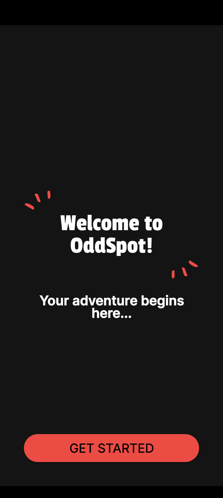
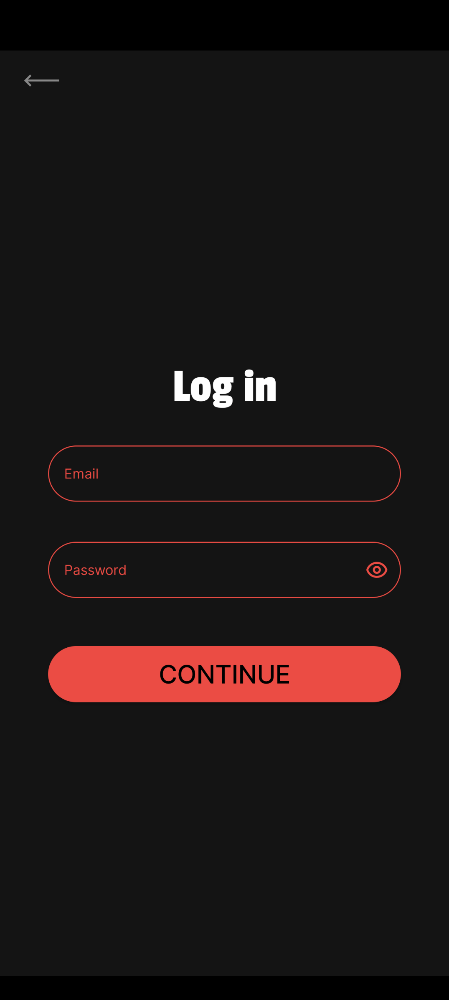
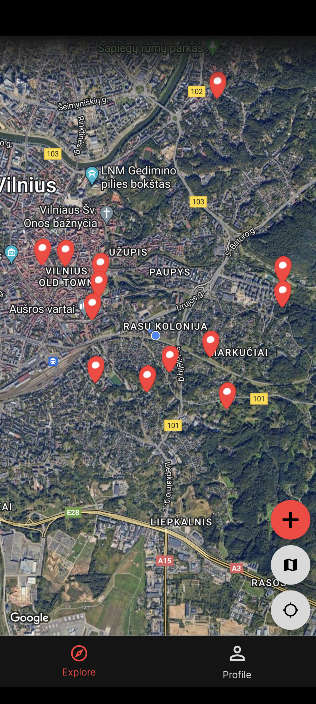
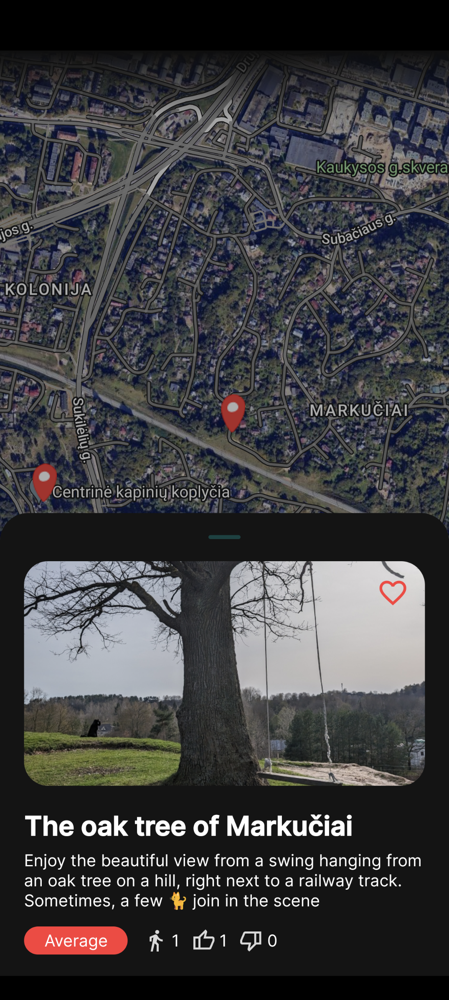
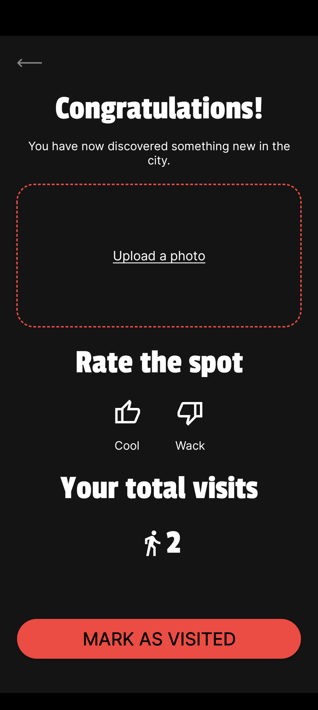
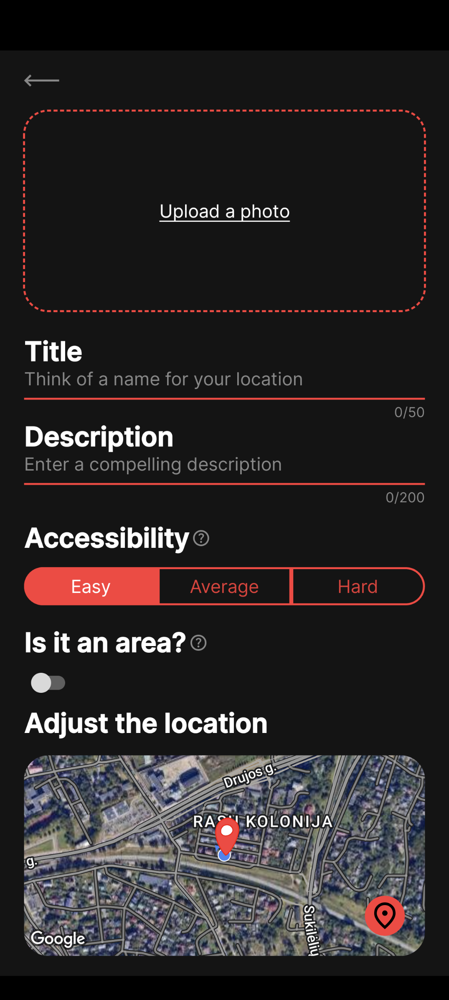
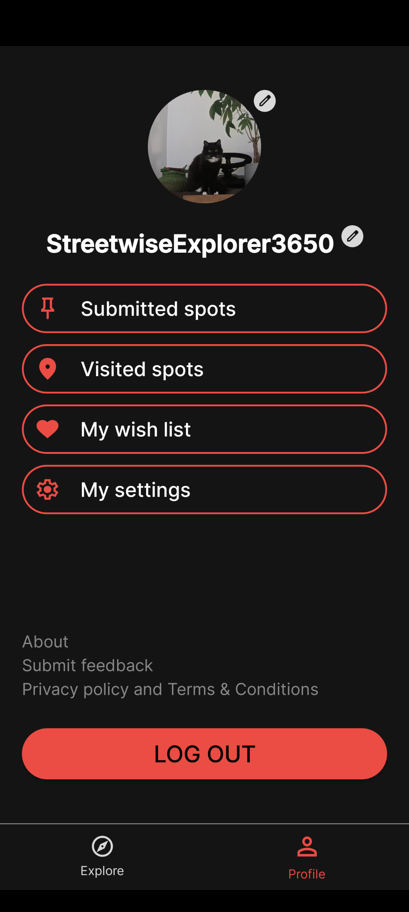
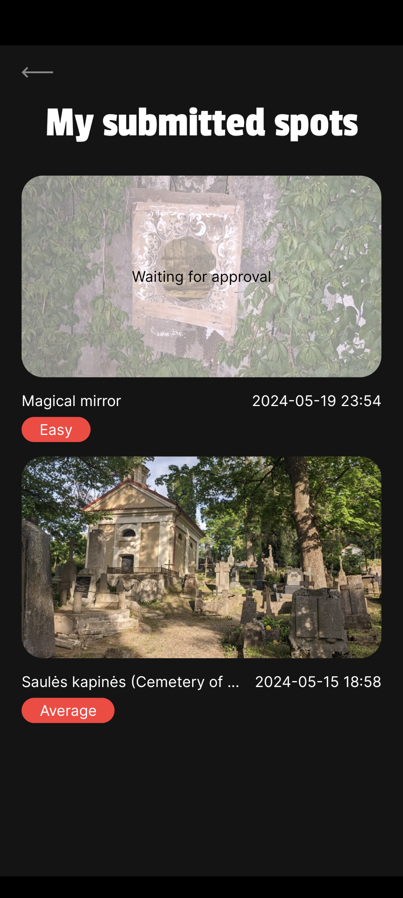
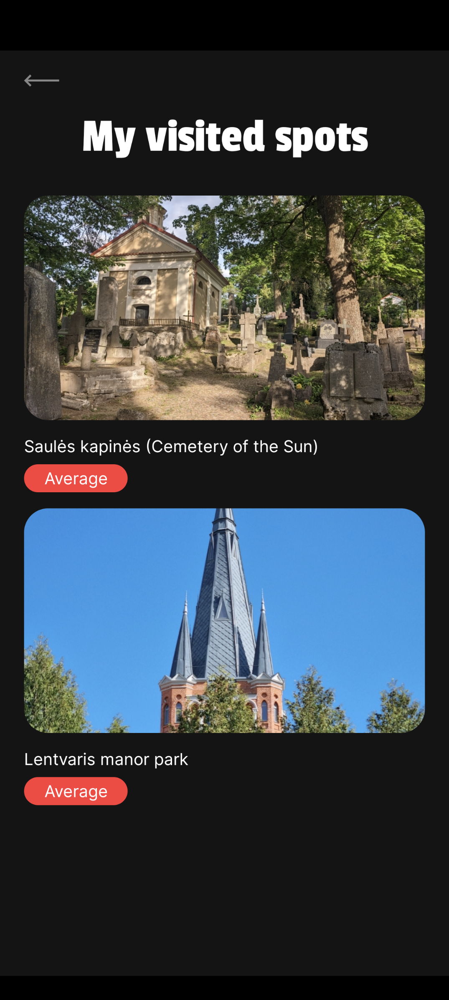
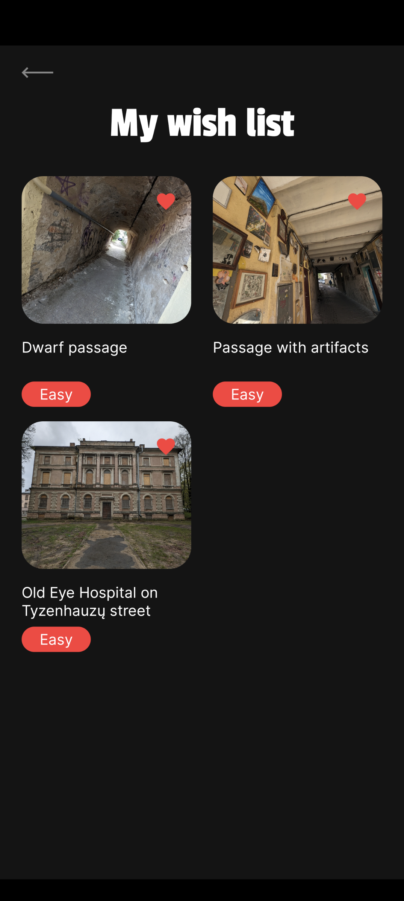

# Oddspot Backend

Oddspot is a Kotlin (Android + iOS + Backend) project that aims to provide a platform for sharing
and discovering interesting spots around the world that aren't commercial establishments.
The project is meant to be an experiment to learn about different use-cases of Kotlin language.

It may not be the cleanest architecturally or have the largest test
coverage as it is being developed by a single developer (me) in my free time.

Frontend repository - https://github.com/fc9734ygn/oddspot-app

UPDATE 2025 - Some opinions on tech have changed, I wouldn't do it the way it's in this repository :D

## Features (as of right now):

- `Routing.kt` - all endpoints are defined here.

## App screenshots:
 
 
 
 
 

## Architecture Overview:

The project architecture follows the Clean Architecture principles, with the following layers:

* data
* service (domain)
* routes (controllers)

### Note on the service layer:
Coming from an Android background where we usually use UseCases/Interactors in the domain layer I may have coupled the domain layer in a slightly incorrect way.
The service classes as of right now represent the business logic layer for each endpoint collection which couples different data types and functionalities into
a single class which violates the single responsibility principle.
What I could have done, was to create an orchestration layer between the controller and service layer that would construct the response using data from services that would contain logic specific to the data type (e.g. User, Spot).
Or I could have used UseCase files containing a single function representing an endpoint.

## Technologies and Frameworks (and opinions):

### Ktor

#### I've had a decision to make between Ktor and Spring and decided to use Ktor because:

- Kotlin idiomatic framework.
- I can use the same network client library for frontend and backend.
- Has less magic which forces me to understand concepts better.
- Is well-supported with coroutines, serialization, Koin DI etc. that I'm already used to coming from Android.

### SQLDelight

#### I've had a decision to make between SQLDelight and Exposed and decided to use SQLDelight because:

- Allows me to use the same database library (reverse ORM, for lack of a better word) for frontend
  and backend.
- Teaches me SQL better as I have to write it myself.

### Koin

- In my opinion, the best DI library for Kotlin projects. Supports pretty much everything Kotlin
  does.

### KSP

- Allows me to use Koin annotations.

### Kotlin-result by Michael Bull

- My favorite Result/Either Monad implementation for Kotlin.
- Allows me to handle my errors explicitly and transform the exceptions into domain errors **when
  needed**.
- I try to follow the "exceptions are for exceptional cases" philosophy but without wrapping every
  Throwable into a domain error without any reason - I'm only writing domain errors when I actually care about the error
  and want to handle it in a specific way.

#### Alternatives:

- Arrow - too heavy for me.
- Result from Kotlin stdlib - doesn't allow sealed classes for error types, which is the main reason
  I use Result type.
- Other Result libraries - I prefer Michael Bull's library syntax.

Interesting read: [The Result Monad](https://adambennett.dev/2020/05/the-result-monad/)

### Detekt

- Allows me to have some static code analysis.

### Postgresql

- Was deciding between MySQL and Postgresql and decided to go with Postgresql.

## Hosting

For hosting, I was looking for the cheapest options with generous free tiers.
The project is deployed on DigitalOcean.
The database is hosted on Supabase.
The files are hosted on Backblaze B2 buckets.

## Tests:

The features have been changing a lot which resulted in me writing tests after a while of the feature being
implemented. For starters, I've added unit tests for the domain layer. I'm planning to add integration tests as a top priority.

## Future Enhancements:

The project is still in its early stages, and there are a lot of things that need to be done.
Unfortunately, the task board is private but for the most part, right now it consists of additional
features and some technical improvements - HTTPS, corrupted uploaded files cleanup, E2E/integration tests, add CI/CD, etc.

## How to Run:

1. Add all required (all used by `com.homato.util.Environment` and `System.getenv()`) environmental variables to your
   environment.
2. When building the project firstly create "user" table as the initialization order starts from spot (alphabetical) and
   fails with unknown relation "user" (SQLDelight issue, I could fix it, but it's not a priority right now).
3. Use Dockerfile in root project directory

Last update: 2024-06-25
